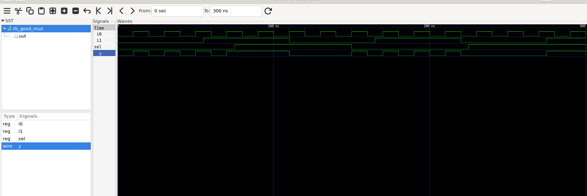
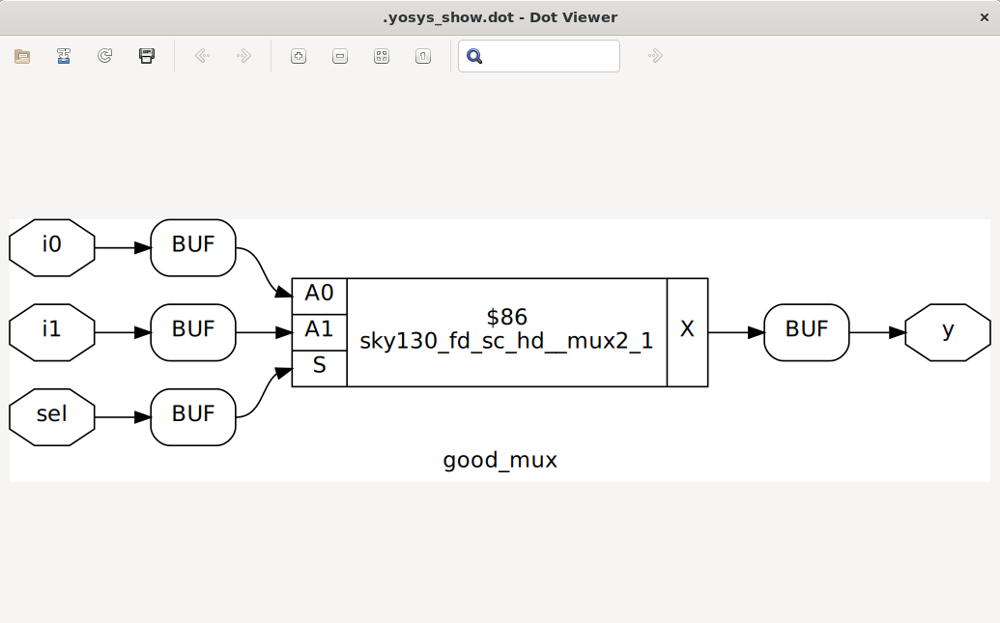

# Day 1 — Introduction to Verilog RTL Design and Synthesis

## Objective

The objective of Day 1 was to set up a local RTL design environment using WSL and understand the basic RTL simulation and synthesis flow.

The lab covered:

* Creating the workshop environment
* Installing and verifying the required tools
* Compiling a Verilog design and its testbench
* Simulating the design using Icarus Verilog
* Generating a VCD waveform file
* Viewing and verifying the waveform using GTKWave
* Reading the RTL design into Yosys
* Synthesizing the design
* Mapping the generic logic to SKY130 standard cells
* Generating a gate-level Verilog netlist

## Tools Used

* Ubuntu through WSL
* Git
* Icarus Verilog
* GTKWave
* Yosys
* ABC
* Graphviz and xdot
* SKY130 standard-cell Liberty library

## Lab Environment

The original workshop repository was cloned using:

```bash
cd /mnt/d/learning
mkdir -p rtl-course
cd rtl-course

git clone https://github.com/vsdip/vsd-rtl.git

cd vsd-rtl/sky130RTLDesignAndSynthesisWorkshop
```

The relevant workshop directories were:

```text
sky130RTLDesignAndSynthesisWorkshop/
├── lib/
├── my_lib/
├── verilog_files/
└── yosys_run.sh
```

The Liberty timing library used for synthesis was located at:

```text
lib/sky130_fd_sc_hd__tt_025C_1v80.lib
```

## RTL Simulation

The multiplexer RTL and its testbench were compiled with Icarus Verilog:

```bash
cd verilog_files
iverilog good_mux.v tb_good_mux.v
```

This produced the simulation executable:

```text
a.out
```

The simulation was run using:

```bash
./a.out
```

Alternatively, it can be run explicitly through `vvp`:

```bash
vvp a.out
```

The testbench generated:

```text
tb_good_mux.vcd
```

## Waveform Verification

The generated waveform was opened with GTKWave:

```bash
gtkwave tb_good_mux.vcd
```

The inputs, select signal, and output were added to the waveform viewer. The waveform was inspected to confirm that the output selected the expected input according to the select signal.

A screenshot of the verified waveform is stored in:

```text
images/good_mux_waveform.png
```

## RTL Synthesis with Yosys

Yosys was launched from the `verilog_files` directory:

```bash
yosys
```

The SKY130 Liberty library and multiplexer RTL were read using:

```tcl
read_liberty -lib ../lib/sky130_fd_sc_hd__tt_025C_1v80.lib
read_verilog good_mux.v
```

The design was synthesized with `good_mux` as the top module:

```tcl
synth -top good_mux
```

After generic synthesis, Yosys represented the design using a generic multiplexer cell.

## Technology Mapping

ABC was used to map the generic logic to cells from the SKY130 standard-cell library:

```tcl
abc -liberty ../lib/sky130_fd_sc_hd__tt_025C_1v80.lib
```

The mapped circuit could then be viewed with:

```tcl
show
```

## Gate-Level Netlist

The synthesized netlist was written without Yosys metadata attributes:

```tcl
write_verilog -noattr good_mux_netlist.v
```

The generated netlist is stored in:

```text
netlist/good_mux_netlist.v
```

## Key Observations

* A testbench provides stimulus for verifying an RTL module.
* Icarus Verilog compiles the design and testbench into a simulation executable.
* Running the simulation creates the VCD waveform specified by the testbench.
* GTKWave displays signal behavior over simulation time.
* Yosys converts behavioral RTL into a generic logic representation.
* ABC maps the generic logic to cells from a target standard-cell library.
* The gate-level netlist contains technology-specific cells rather than behavioral RTL constructs.

## Attribution

This lab is based on the Master RTL Design & Synthesis for VLSI Interview Labs course from VLSI System Design. The starting lab material belongs to its respective authors. This repository documents my environment, execution, observations, and generated results.
