# Day 2 — Timing Libraries, Hierarchical Synthesis and Flip-Flop Coding Styles

## Overview

Day 2 focused on understanding the SKY130 timing library, preserving or flattening module hierarchy during synthesis, and writing different types of D flip-flops in Verilog.

The labs also demonstrated how Yosys maps flip-flops to SKY130 standard cells and how simple arithmetic operations can sometimes be implemented entirely through wiring.

## SKY130 Timing Library and PVT Corner

The Liberty timing library used during the labs was:

```text
sky130_fd_sc_hd__tt_025C_1v80.lib
```

The name describes the library and the conditions under which it was characterized:

* `sky130` refers to the SKY130 process technology.
* `fd_sc_hd` identifies the high-density standard-cell library.
* `tt` means typical NMOS and typical PMOS process behavior.
* `025C` represents a temperature of 25 °C.
* `1v80` represents a supply voltage of 1.80 V.

These process, voltage and temperature conditions are collectively known as the **PVT corner**.

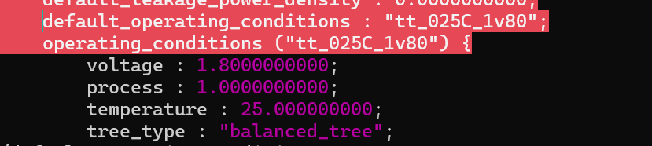

A Liberty file describes the available standard cells and includes information such as:

* Boolean functions
* Pin capacitance
* Timing delays and transitions
* Leakage and internal power
* Cell area
* Operating conditions

### Cell Drive Strength

The library contains several versions of cells that perform the same logical function but have different drive strengths. For example, the `and2_0`, `and2_2` and `and2_4` cells all implement a two-input AND function.

The stronger cells generally occupy more area and consume more power, but they can drive larger loads more effectively.

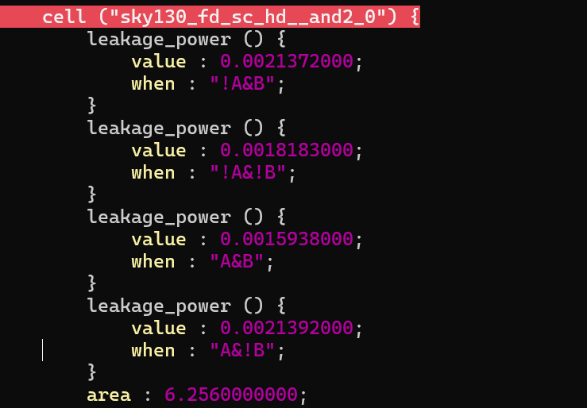

PMOS transistors have lower carrier mobility than NMOS transistors and are normally made wider to provide comparable drive strength. This also helps explain why NAND-based implementations are often more efficient than equivalent NOR-based implementations.

## Hierarchical Synthesis

The `multiple_modules.v` design contains two child modules:

* `sub_module1` implements an AND operation.
* `sub_module2` implements an OR operation.
* `multiple_modules` connects both child modules together.

The resulting function is:

```text
y = (a & b) | c
```

The design was synthesized with:

```tcl
read_liberty -lib ../lib/sky130_fd_sc_hd__tt_025C_1v80.lib
read_verilog multiple_modules.v
hierarchy -check -top multiple_modules
synth -top multiple_modules
abc -liberty ../lib/sky130_fd_sc_hd__tt_025C_1v80.lib
show multiple_modules
```

In the hierarchical result, the top module still contains instances `u1` and `u2` of the child modules.

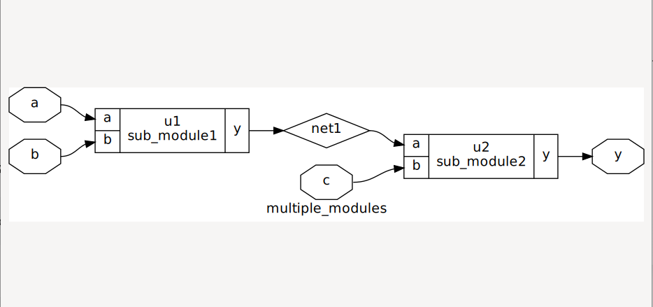

The hierarchical netlist is stored at:

```text
netlist/hierarchy/multiple_modules_hier.v
```

## Flattened Synthesis

The same synthesized design was flattened using:

```tcl
flatten
clean
show multiple_modules
```

Flattening replaces the child-module instances with their internal logic. The resulting netlist contains only the top-level `multiple_modules` definition.

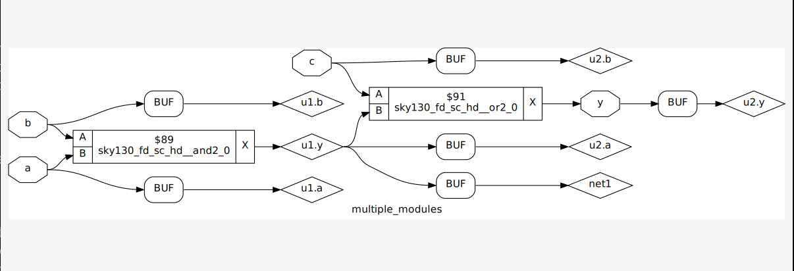

The flattened netlist is stored at:

```text
netlist/hierarchy/multiple_modules_flat.v
```

The hierarchical netlist contained three module definitions, while the flattened netlist contained only one. Flattening can make whole-design optimization easier, while keeping hierarchy can make a large design easier to understand and manage.

## Flip-Flop Coding Styles

Four flip-flop designs were studied:

| Design                 | Behaviour                                               |
| ---------------------- | ------------------------------------------------------- |
| `dff_asyncres`         | Asynchronous active-high reset                          |
| `dff_async_set`        | Asynchronous active-high set                            |
| `dff_syncres`          | Synchronous active-high reset                           |
| `dff_asyncres_syncres` | Asynchronous reset with an additional synchronous reset |

The key difference is when the control input is allowed to change the output.

An asynchronous reset or set can affect `q` immediately. A synchronous reset is only evaluated at the active clock edge.

### Asynchronous Reset

The asynchronous-reset flip-flop uses both the clock edge and reset edge in its sensitivity list:

```verilog
always @(posedge clk or posedge async_reset)
```

When `async_reset` is asserted, `q` becomes zero without waiting for a clock edge.

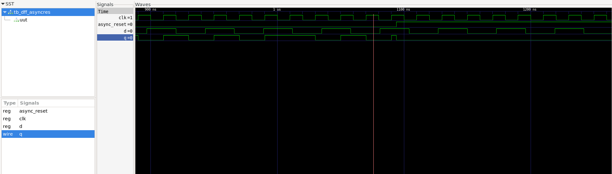

### Asynchronous Set

The asynchronous-set flip-flop immediately sets `q` to one when `async_set` is asserted.

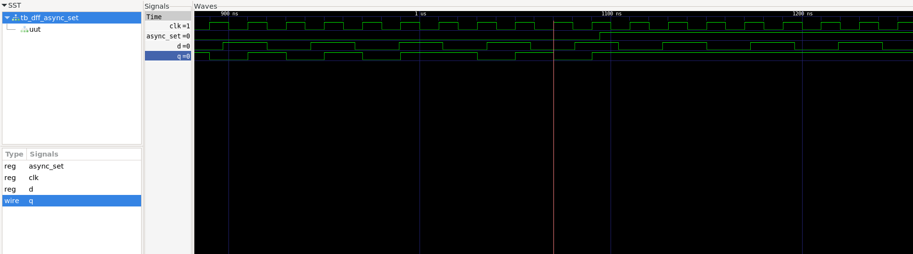

### Synchronous Reset

The synchronous-reset flip-flop only checks `sync_reset` at the positive edge of the clock. Asserting reset between clock edges does not immediately affect `q`.

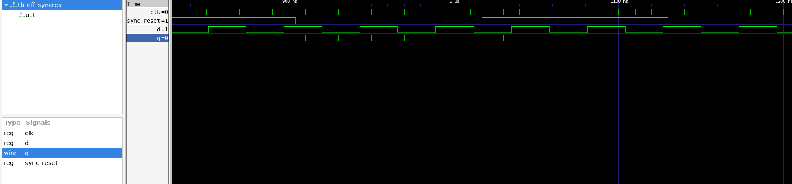

### Asynchronous and Synchronous Reset

This design contains both reset styles. The order of the conditions gives the asynchronous reset the highest priority.

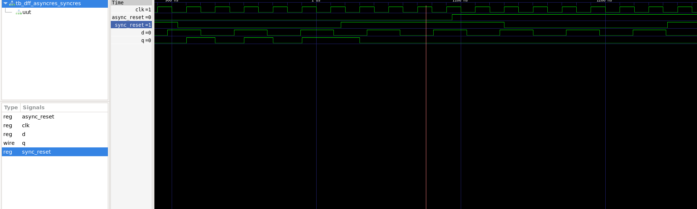

## Flip-Flop Synthesis and Technology Mapping

The flip-flops were synthesized and mapped with:

```tcl
synth -top <module_name>
dfflibmap -liberty ../lib/sky130_fd_sc_hd__tt_025C_1v80.lib
abc -liberty ../lib/sky130_fd_sc_hd__tt_025C_1v80.lib
clean
show
```

The `dfflibmap` pass maps the generic flip-flops inferred from the RTL to sequential cells available in the SKY130 library. ABC maps the remaining combinational logic.

### Asynchronous-Reset Mapping

The asynchronous-reset design was mapped to a SKY130 `dfrtp` flip-flop cell.

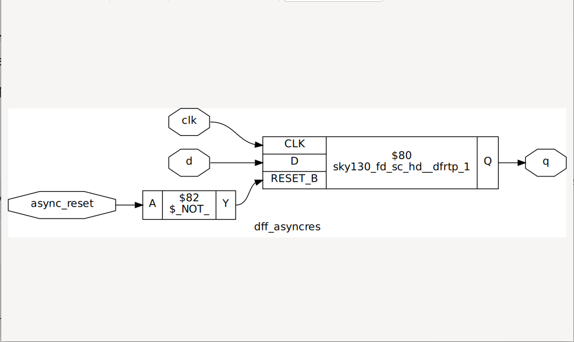

Generated netlist:

```text
netlist/flops/dff_asyncres_netlist.v
```

### Asynchronous-Set Mapping

The asynchronous-set design was mapped to a SKY130 `dfstp` flip-flop cell.

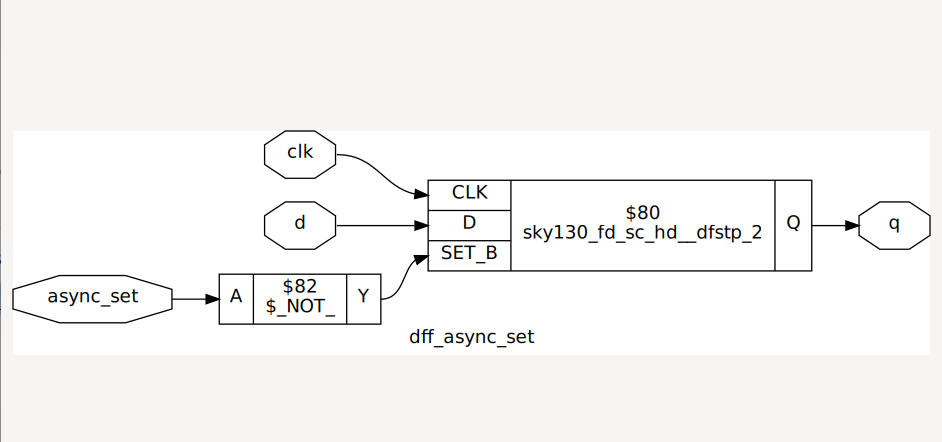

Generated netlist:

```text
netlist/flops/dff_async_set_netlist.v
```

### Synchronous-Reset Mapping

The synchronous-reset design was implemented using an ordinary SKY130 `dfxtp` flip-flop with combinational reset logic placed before its D input.

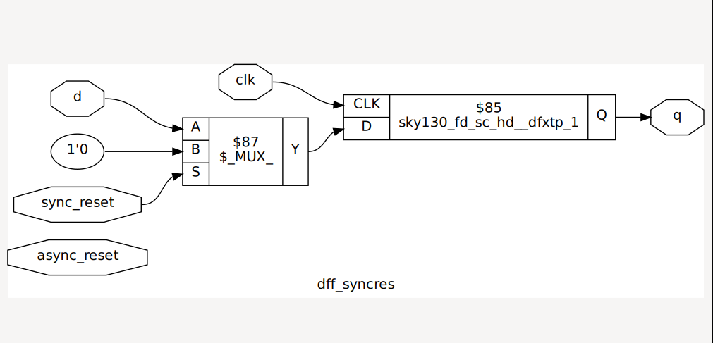

Generated netlist:

```text
netlist/flops/dff_syncres_netlist.v
```

This shows an important difference between asynchronous and synchronous resets. An asynchronous reset requires a suitable control pin on the selected flip-flop cell, while a synchronous reset can be implemented through the logic feeding the D input.

## Multiplication by Powers of Two

The final lab examined multiplication by constant powers of two.

For a three-bit input:

```verilog
assign y = a * 2;
```

Yosys simplified the operation to:

```verilog
assign y = { a, 1'b0 };
```

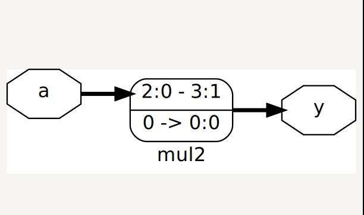

Similarly:

```verilog
assign y = a * 8;
```

was implemented as:

```verilog
assign y = { a, 3'b000 };
```

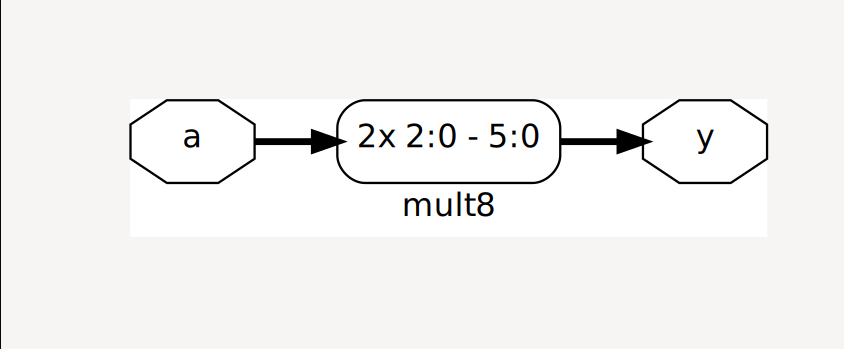

The generated netlists are stored in:

```text
netlist/optimizations/mult_2_netlist.v
netlist/optimizations/mult_8_netlist.v
```

No standard cells were needed for these operations because unsigned multiplication by (2^n) is equivalent to shifting left by (n) positions and filling the lower bits with zeros.

## Main Takeaways

* A Liberty file characterizes standard cells at a particular PVT corner.
* Cells with greater drive strength usually require more area and power.
* Hierarchical synthesis preserves module boundaries.
* Flattening inserts child logic into the top module and removes the child-module definitions.
* Asynchronous controls affect a flip-flop independently of the clock.
* Synchronous controls are evaluated only at the active clock edge.
* `dfflibmap` maps inferred flip-flops to sequential cells from the target library.
* Constant multiplication by a power of two can be reduced to wiring and zero padding.

## Attribution

This work is based on the **Master RTL Design & Synthesis for VLSI Interview Labs** course from VLSI System Design. The original RTL and testbench examples belong to their respective authors. This repository records my lab execution, generated results and understanding of the concepts.
