# Day 3 — Combinational and Sequential Optimizations

## Overview

Day 3 focused on how synthesis tools simplify combinational and sequential RTL while preserving externally observable behavior.

The labs demonstrated:

* Constant propagation
* Boolean logic optimization
* Optimization across module boundaries
* Sequential constant propagation
* Removal of redundant flip-flops
* Removal of unused counter state
* SKY130 technology mapping of optimized designs

Advanced techniques such as state optimization, retiming and sequential logic cloning were discussed conceptually but were not part of the labs.

## Tools Used

* Icarus Verilog
* GTKWave
* Yosys
* ABC
* Graphviz and xdot
* SKY130 standard-cell Liberty library

The Liberty file used for technology mapping was:

```text
../lib/sky130_fd_sc_hd__tt_025C_1v80.lib
```

## Combinational Logic Optimization

Combinational optimization reduces Boolean logic while maintaining the same input-to-output behavior. This can reduce area, power and propagation delay.

The main forms studied were constant propagation and Boolean simplification.

### Common Yosys Flow

The combinational designs were synthesized using:

```tcl
read_liberty -lib ../lib/sky130_fd_sc_hd__tt_025C_1v80.lib
read_verilog <design>.v
synth -top <top_module>
opt_clean -purge
abc -liberty ../lib/sky130_fd_sc_hd__tt_025C_1v80.lib
clean
stat
show
write_verilog -noattr <design>_netlist.v
```

`opt_clean -purge` removes unused cells and wires, while ABC maps the remaining logic to cells from the SKY130 library.

## `opt_check`

The first design used a ternary expression:

```verilog
assign y = a ? b : 0;
```

This simplifies to:

```text
y = a & b
```

Yosys mapped the design to one `sky130_fd_sc_hd__and2_0` cell.

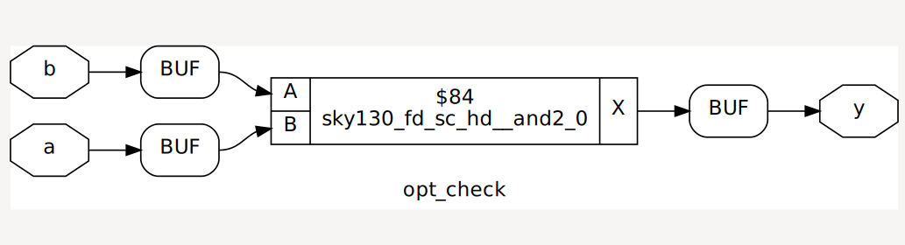

Generated netlist:

```text
netlist/combinational/opt_check_netlist.v
```

## `opt_check2`

The second design used:

```verilog
assign y = a ? 1 : b;
```

This simplifies to:

```text
y = a | b
```

The mapped netlist contains one `sky130_fd_sc_hd__or2_0` cell.

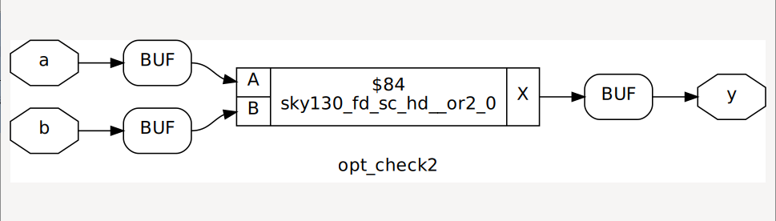

Generated netlist:

```text
netlist/combinational/opt_check2_netlist.v
```

## `opt_check3`

The nested ternary expression was:

```verilog
assign y = a ? (c ? b : 0) : 0;
```

This reduces to:

```text
y = a & b & c
```

Yosys mapped the result to one `sky130_fd_sc_hd__and3_1` cell.

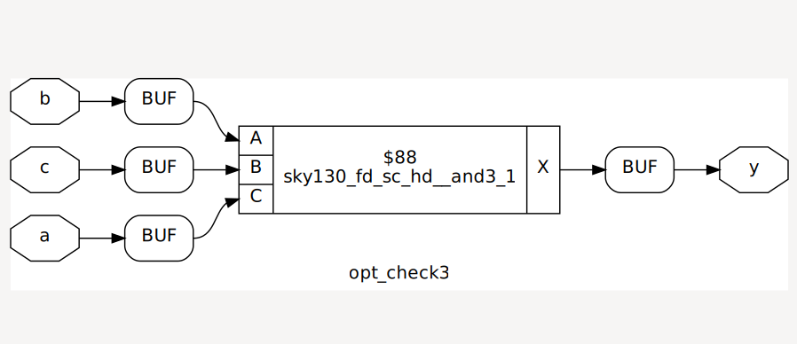

Generated netlist:

```text
netlist/combinational/opt_check3_netlist.v
```

## `opt_check4`

The fourth design contained a more complex nested conditional:

```verilog
assign y = a ? (b ? (a & c) : c) : (!c);
```

The expression simplifies to an XNOR function between `a` and `c`. Input `b` has no effect on the final output and is removed from the implemented logic.

Yosys mapped the result to one `sky130_fd_sc_hd__xnor2_1` cell.

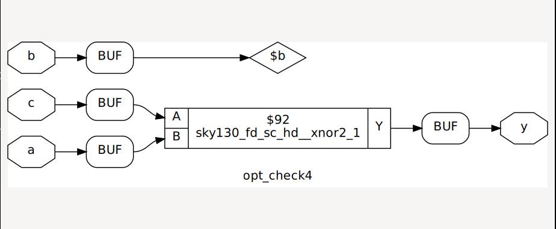

Generated netlist:

```text
netlist/combinational/opt_check4_netlist.v
```

## Optimization Across Module Boundaries

The multiple-module examples contain constants and unused intermediate results inside child-module instances.

The designs were flattened before the explicit cleanup pass:

```tcl
read_liberty -lib ../lib/sky130_fd_sc_hd__tt_025C_1v80.lib
read_verilog <design>.v
synth -top <top_module>
flatten
opt_clean -purge
abc -liberty ../lib/sky130_fd_sc_hd__tt_025C_1v80.lib
clean
stat
show <top_module>
write_verilog -noattr <design>_netlist.v
```

Flattening exposes the child-module logic inside the top-level module, allowing constants and unused paths to be optimized across former hierarchy boundaries.

### `multiple_module_opt`

The useful logic reduces to:

```text
y = c | (a & b)
```

The mapped implementation uses one `sky130_fd_sc_hd__a21o_1` compound cell.

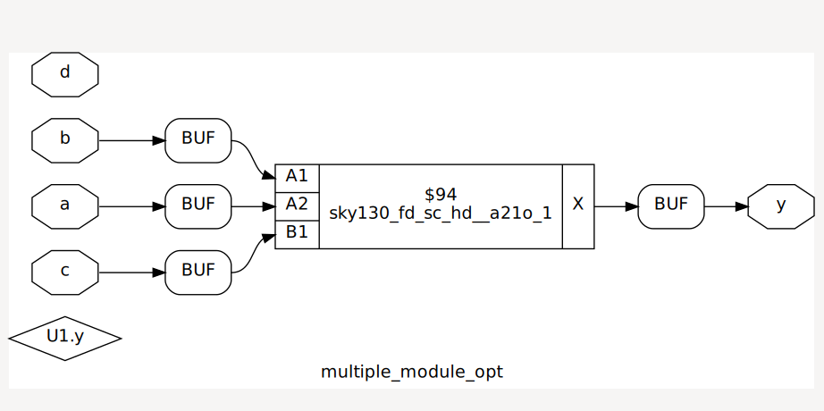

Generated netlist:

```text
netlist/combinational/multiple_module_opt_netlist.v
```

### `multiple_module_opt2`

One submodule receives a constant zero:

```verilog
sub_module U1 (.a(a), .b(1'b0), .y(n1));
```

Therefore, `n1` is always zero. Since the final output is ANDed with `n1`, the complete output becomes constant zero.

Yosys removes every cell and produces:

```verilog
assign y = 1'b0;
```

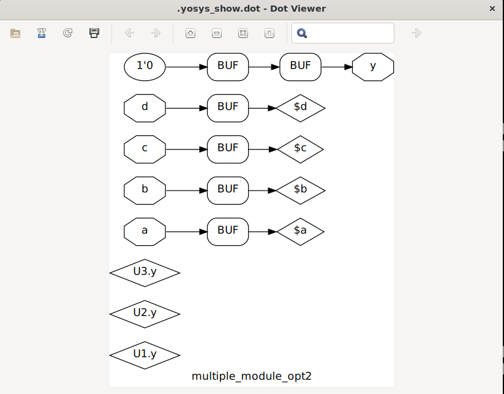

Generated netlist:

```text
netlist/combinational/multiple_module_opt2_netlist.v
```

## Sequential Logic Optimization

Sequential optimization must preserve behavior across reset, set and clock events. A register can be removed only when its output is provably constant or cannot affect an observable output.

The sequential designs were mapped using:

```tcl
read_liberty -lib ../lib/sky130_fd_sc_hd__tt_025C_1v80.lib
read_verilog <design>.v
synth -top <top_module>
dfflibmap -liberty ../lib/sky130_fd_sc_hd__tt_025C_1v80.lib
abc -liberty ../lib/sky130_fd_sc_hd__tt_025C_1v80.lib
clean
stat
show
write_verilog -noattr <design>_netlist.v
```

## Sequential Constant Propagation

Five flip-flop examples were simulated and synthesized to compare which registers remained after optimization.

| Design       | Synthesis result                   |
| ------------ | ---------------------------------- |
| `dff_const1` | One flip-flop retained             |
| `dff_const2` | Output replaced by constant `1`    |
| `dff_const3` | Two flip-flops retained            |
| `dff_const4` | Registers replaced by constant `1` |
| `dff_const5` | Two flip-flops retained            |

### `dff_const1`

During reset, `q` is zero. After reset is released, it becomes one at the next rising clock edge. Since its value depends on event history, one flip-flop is required.

The mapped design contains:

* One `sky130_fd_sc_hd__dfrtp_1`
* One reset-polarity inverter

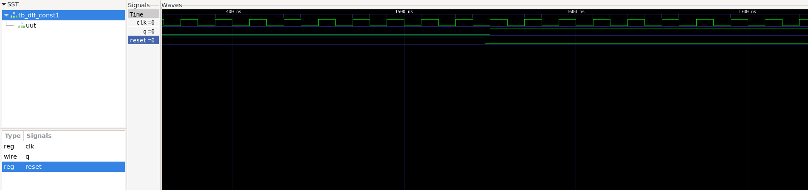

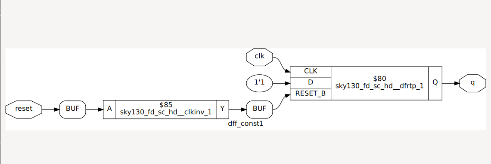

### `dff_const2`

Both reset and normal operation assign one:

```verilog
if (reset)
    q <= 1'b1;
else
    q <= 1'b1;
```

The output is always one, so Yosys removes the flip-flop:

```verilog
assign q = 1'b1;
```

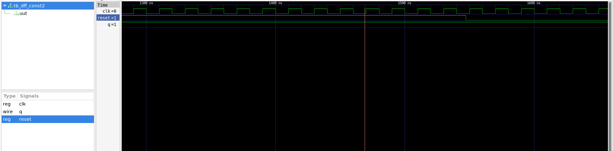

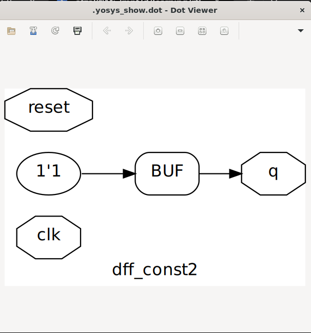

### `dff_const3`

The design contains two registers with different asynchronous values. After reset is released, the output passes through a two-clock transition that must be preserved.

The mapped design contains:

* One `sky130_fd_sc_hd__dfrtp_1`
* One `sky130_fd_sc_hd__dfstp_2`
* Two control-polarity inverters

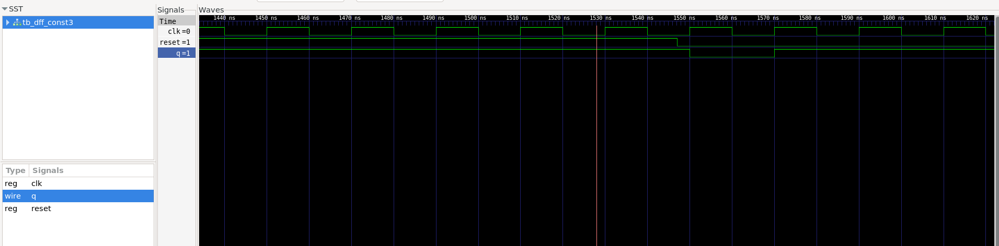

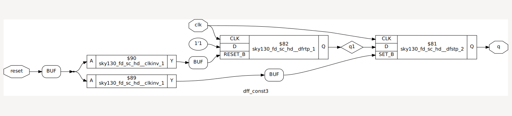

### `dff_const4`

Both registers are assigned one during reset and normal operation. Neither register stores observable information, so both are optimized away.

The generated netlist contains constant assignments:

```verilog
assign q = 1'b1;
assign q1 = 1'b1;
```

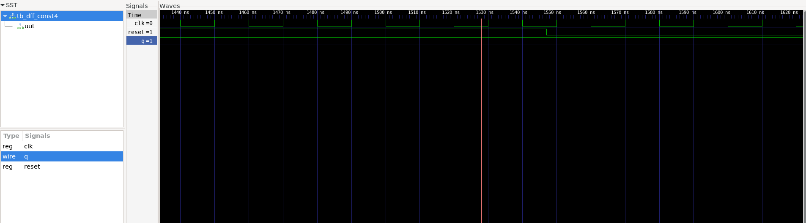

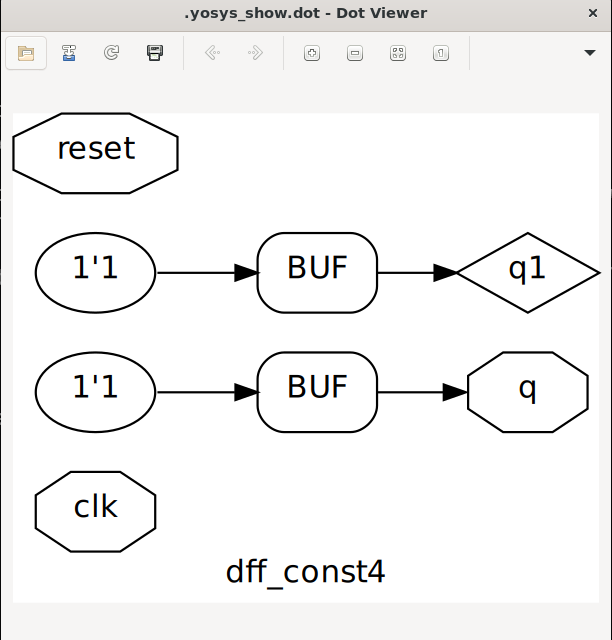

### `dff_const5`

Both registers reset to zero. After reset is released, `q1` becomes one on the first rising edge and `q` receives the previous value of `q1`. The resulting clock-dependent sequence requires both flip-flops.

The mapped design contains:

* Two `sky130_fd_sc_hd__dfrtp_1` cells
* Two reset-polarity inverters

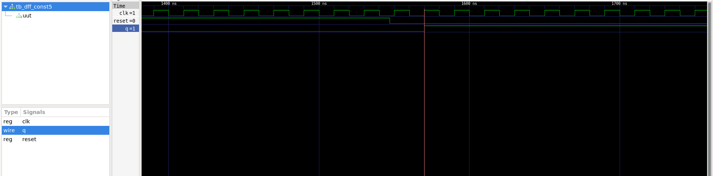

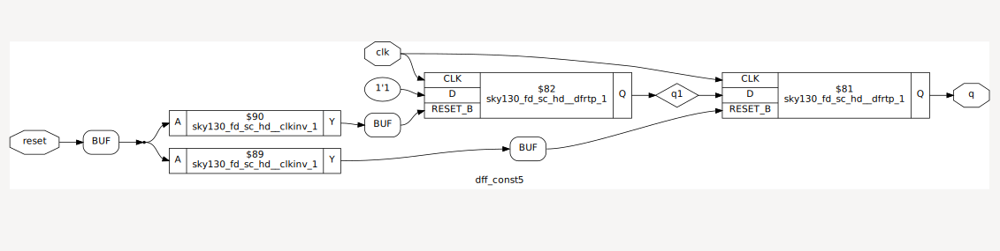

## Counter-State Optimization

Two versions of a three-bit counter were compared.

### Only the LSB Is Observable

The first counter uses:

```verilog
assign q = count[0];
```

Only the least-significant bit affects the output. Its next-state equation is equivalent to:

```text
count[0]next = ~count[0]
```

The upper two state bits cannot affect `q`, so Yosys removes them and retains only one flip-flop with an inverted feedback path.

The mapped netlist contains:

* One `sky130_fd_sc_hd__dfrtp_1`
* One feedback inverter
* One reset-polarity inverter

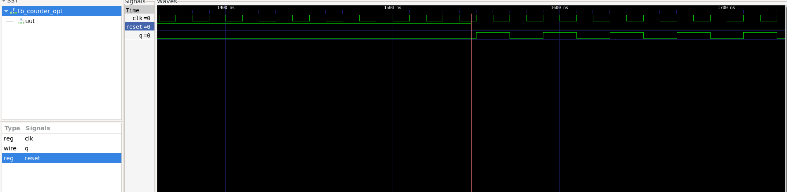

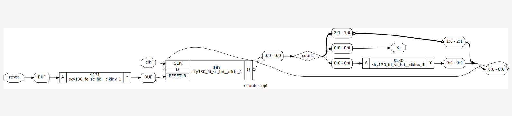

Generated netlist:

```text
netlist/sequential/counter_opt_netlist.v
```

### The Complete Counter State Is Observable

The comparison version uses:

```verilog
assign q = (count[2:0] == 3'b100);
```

All three bits affect the equality result, so all three counter flip-flops and the associated increment and comparison logic must remain.

The mapped result contains:

* Three `sky130_fd_sc_hd__dfrtp_1` cells
* Increment logic
* Equality-comparison logic
* Reset-polarity inverters

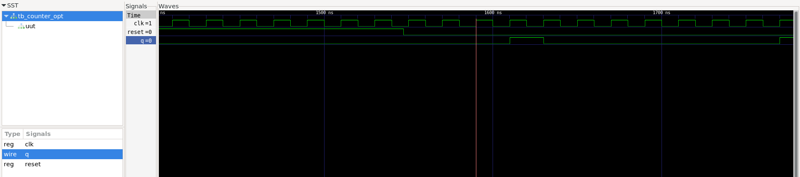

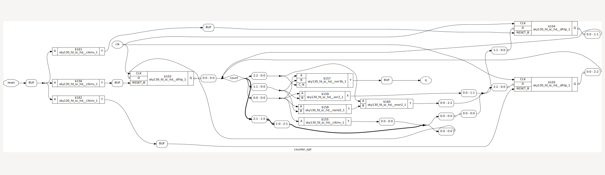

Generated netlist:

```text
netlist/sequential/counter_opt2_netlist.v
```

## Advanced Sequential Optimizations

The course also introduced the following techniques conceptually, although they were not included in the labs:

* **State optimization:** removes unreachable states or combines equivalent states.
* **Retiming:** moves registers across combinational logic to balance pipeline delays.
* **Sequential logic cloning:** duplicates registers or logic to reduce fanout and improve physically aware timing.

## Main Takeaways

* RTL describes behavior rather than guaranteeing a literal hardware structure.
* Constant propagation can remove gates, registers and complete logic paths.
* Boolean expressions and nested conditional operators can reduce to simpler standard cells.
* Flattening allows optimization across module boundaries.
* A constant D input does not automatically make a flip-flop removable.
* Sequential optimization must preserve reset, set and clock-dependent behavior.
* Registers that cannot affect an observable output can be removed.
* Only one bit of a multi-bit counter is retained when the other state bits cannot affect the output.
* Using the complete counter value in a comparison requires all state bits to remain.
* `dfflibmap` maps inferred flip-flops while ABC maps combinational logic.

## Attribution

This work is based on the **Master RTL Design & Synthesis for VLSI Interview Labs** course from VLSI System Design. The original RTL and testbench examples belong to their respective authors. This repository records my lab execution, generated results and understanding of the concepts.
