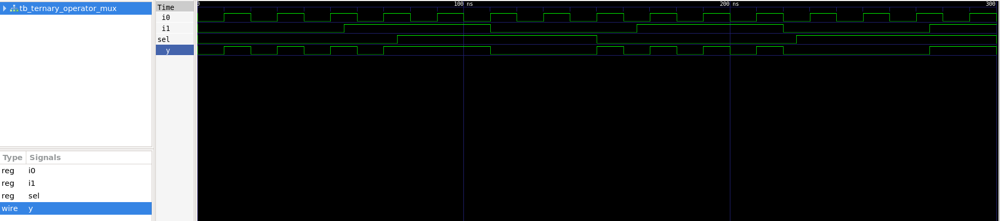
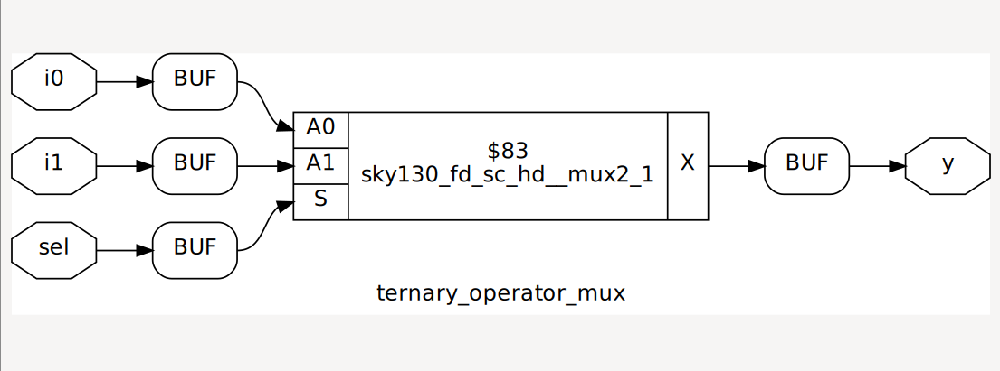
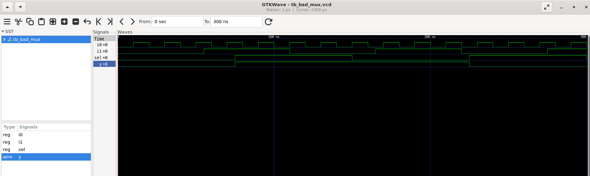
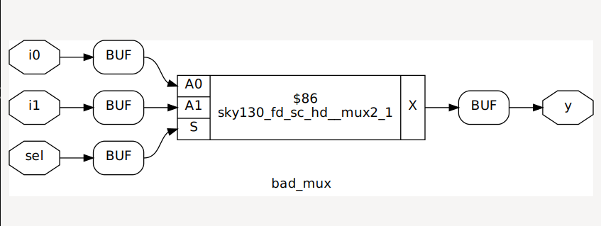
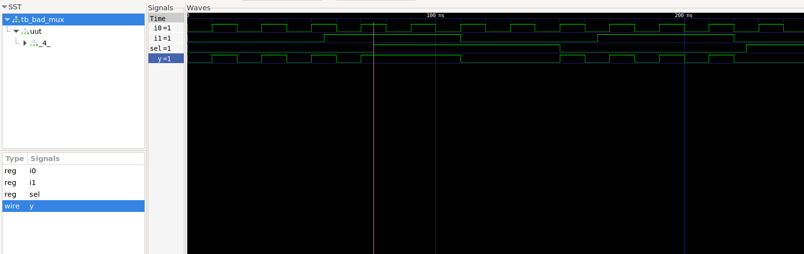
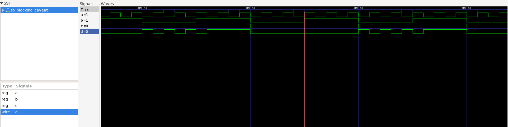
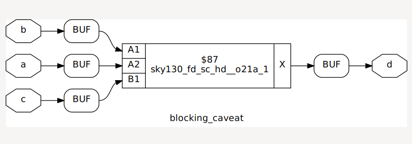
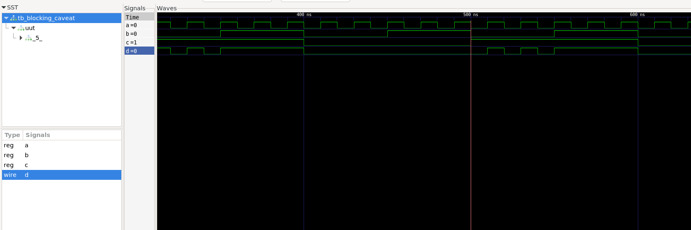

# Day 4 — Gate-Level Simulation and Synthesis–Simulation Mismatch

## Overview

Day 4 focused on gate-level simulation (GLS), synthesis–simulation mismatches, sensitivity lists, and blocking versus nonblocking assignments.

The labs demonstrated:

- Functional RTL simulation of a 2:1 multiplexer
- Gate-level simulation using SKY130 standard-cell models
- A synthesis–simulation mismatch caused by an incomplete sensitivity list
- A mismatch caused by incorrect blocking-assignment ordering
- Comparison of RTL and synthesized-netlist waveforms
- SKY130 technology mapping of combinational designs

## Tools Used

- Icarus Verilog
- GTKWave
- Yosys
- ABC
- Graphviz and xdot
- SKY130 standard-cell Liberty and Verilog models

The Liberty file used for technology mapping was:

```text
../lib/sky130_fd_sc_hd__tt_025C_1v80.lib
```

The SKY130 Verilog models used for GLS were:

```text
../my_lib/verilog_model/primitives.v
../my_lib/verilog_model/sky130_fd_sc_hd.v
```

## Gate-Level Simulation

Gate-level simulation runs the testbench against the synthesized netlist instead of the original RTL.

For functional GLS, the simulation contains:

1. The testbench
2. The synthesized gate-level netlist
3. The Verilog models for the standard cells instantiated in the netlist

GLS verifies that the synthesized implementation has the expected logical behavior. Timing validation requires delay-annotated cell models and was outside the scope of these labs.

## Blocking and Nonblocking Assignments

A blocking assignment uses `=` and updates its left-hand side immediately. Statements therefore execute in procedural order.

A nonblocking assignment uses `<=`. Its right-hand side is evaluated when the statement is reached, while the left-hand-side update is scheduled for the end of the current simulation time step.

The normal RTL coding convention is:

- Use blocking assignments for combinational logic.
- Use nonblocking assignments for clocked sequential logic.

In combinational logic, intermediate values must be calculated before they are consumed. In clocked logic, nonblocking assignments allow multiple registers to sample their old input values at the same clock edge.

## Reference Ternary-Operator Multiplexer

The reference design describes a 2:1 multiplexer using a continuous ternary assignment:

```verilog
assign y = sel ? i1 : i0;
```

Its behavior is:

| `sel` | Output |
| --- | --- |
| `0` | `y = i0` |
| `1` | `y = i1` |

Because this is a continuous assignment, `y` is reevaluated whenever `i0`, `i1`, or `sel` changes.

### RTL Simulation



The waveform confirms that `y` follows `i0` when `sel=0` and follows `i1` when `sel=1`.

### Synthesis

The design was synthesized and mapped using:

```tcl
read_liberty -lib ../lib/sky130_fd_sc_hd__tt_025C_1v80.lib
read_verilog ternary_operator_mux.v
synth -top ternary_operator_mux
abc -liberty ../lib/sky130_fd_sc_hd__tt_025C_1v80.lib
clean
stat
show
write_verilog -noattr ternary_operator_mux_netlist.v
```

ABC mapped the mux to one `sky130_fd_sc_hd__mux2_1` standard cell.



Generated netlist:

```text
netlist/ternary_operator_mux_netlist.v
```

## Missing Sensitivity List: `bad_mux`

The procedural mux uses an incomplete sensitivity list:

```verilog
always @(sel)
begin
    if (sel)
        y <= i1;
    else
        y <= i0;
end
```

The simulator enters this block only when `sel` changes. Changes to `i0` and `i1` do not trigger reevaluation.

Consequently:

- When `sel=0`, changes in `i0` may not propagate to `y`.
- When `sel=1`, changes in `i1` may not propagate to `y`.
- The simulated output can retain a stale value until `sel` changes.

### RTL Simulation Mismatch



The RTL waveform shows intervals where the selected data input changes but `y` retains its previous value.

### Synthesized Hardware

Synthesis interprets the conditional logic as a complete 2:1 multiplexer. A physical combinational mux responds to all three inputs and has no Verilog sensitivity list.



Generated netlist:

```text
netlist/bad_mux_netlist.v
```

### Gate-Level Simulation

The mapped netlist was simulated using:

```bash
iverilog -o gls_bad_mux \
  ../my_lib/verilog_model/primitives.v \
  ../my_lib/verilog_model/sky130_fd_sc_hd.v \
  bad_mux_netlist.v \
  tb_bad_mux.v

vvp gls_bad_mux
gtkwave tb_bad_mux.vcd
```



In GLS, `y` follows the selected input correctly:

- `y=i0` when `sel=0`
- `y=i1` when `sel=1`

Therefore:

```text
Faulty RTL simulation != synthesized-netlist simulation
```

The correct combinational description should use a complete sensitivity list:

```verilog
always @(*)
begin
    if (sel)
        y = i1;
    else
        y = i0;
end
```

## Blocking-Assignment Ordering: `blocking_caveat`

The second mismatch uses blocking assignments in an unsafe order:

```verilog
always @(*)
begin
    d = x & c;
    x = a | b;
end
```

The intended function is:

```text
x = a | b
d = x & c
```

Therefore:

```text
d = (a | b) & c
```

However, blocking statements execute from top to bottom. The first statement calculates `d` using the old value of `x`; only afterward is `x` updated.

### RTL Simulation Mismatch



The RTL output can therefore lag behind the intended combinational result.

### Synthesized Hardware

Synthesis recognizes the combinational data dependency and implements the Boolean function:

```text
d = (a | b) & c
```

The mapped implementation uses a SKY130 compound gate.



Generated netlist:

```text
netlist/blocking_caveat_netlist.v
```

### Gate-Level Simulation

The gate-level netlist was simulated with the same testbench and SKY130 cell models.



The GLS output follows the synthesized combinational function and differs from the faulty RTL result during the mismatch intervals.

The RTL can be corrected by calculating the producer before its consumer:

```verilog
always @(*)
begin
    x = a | b;
    d = x & c;
end
```

## Results Summary

| Design | RTL behavior | Synthesized behavior | Result |
| --- | --- | --- | --- |
| `ternary_operator_mux` | Correct 2:1 mux | Correct 2:1 mux | Match |
| `bad_mux` | Output can remain stale | Correct 2:1 mux | Mismatch |
| `blocking_caveat` | Output can use old `x` | `d=(a\|b)&c` | Mismatch |

## Key Takeaways

- GLS verifies the behavior of the synthesized gate-level netlist.
- Synthesizable RTL is not necessarily simulation-correct RTL.
- An incomplete combinational sensitivity list can leave simulation outputs stale.
- `always @(*)` prevents manual sensitivity-list omissions.
- Blocking assignments execute in written order.
- Combinational intermediate values must be assigned before they are used.
- Nonblocking assignments should normally be used for clocked sequential logic.
- Comparing RTL simulation with GLS can expose synthesis–simulation mismatches.
