# Day 5 — Optimization in Synthesis

## Overview

Day 5 explored how conditional statements and loops in Verilog are interpreted by synthesis tools.

The main focus was understanding:

* Priority logic created by `if-else` statements
* Unintended latch inference from incomplete assignments
* Complete and incomplete `case` statements
* Synthesis–simulation mismatch caused by overlapping case items
* Using procedural `for` loops to describe multiplexers and demultiplexers
* Using a generate block to replicate hardware
* Building an 8-bit ripple-carry adder from full-adder instances

## Tools Used

* Icarus Verilog
* GTKWave
* Yosys and ABC
* Graphviz and xdot
* SKY130 standard-cell Liberty and Verilog models

The SKY130 Liberty file used for technology mapping was:

```text
../lib/sky130_fd_sc_hd__tt_025C_1v80.lib
```

## Incomplete `if` Statements

An `if` statement inside a combinational block must assign its output for every possible condition. If an assignment is missing, the output must remember its previous value, so synthesis infers a latch.

### Single Incomplete `if`

The first design assigns `y` only when `i0` is high:

```verilog
always @(*) begin
    if (i0)
        y <= i1;
end
```

Its behavior is:

* When `i0=1`, `y` follows `i1`.
* When `i0=0`, `y` retains its previous value.

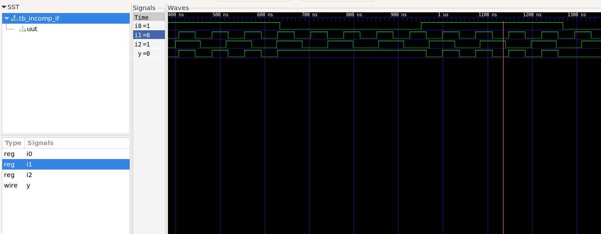

Yosys inferred a positive-enable latch with `i1` connected to its data input and `i0` acting as its enable.

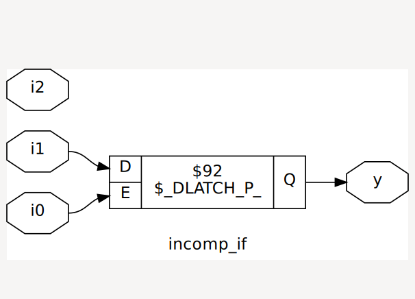

Generated netlist:

```text
netlist/incomp_if_netlist.v
```

### Nested Incomplete `if-else`

The second design contains two conditions:

```verilog
always @(*) begin
    if (i0)
        y <= i1;
    else if (i2)
        y <= i3;
end
```

This also describes priority:

1. `i0` has the highest priority.
2. `i2` is checked only when `i0=0`.
3. When both conditions are false, `y` retains its previous value.

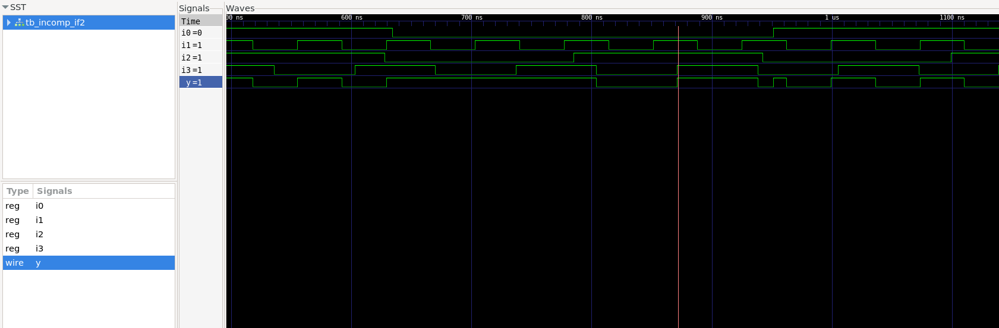

The synthesized circuit contains selection logic followed by a latch. The latch is enabled whenever either assignment condition is active.

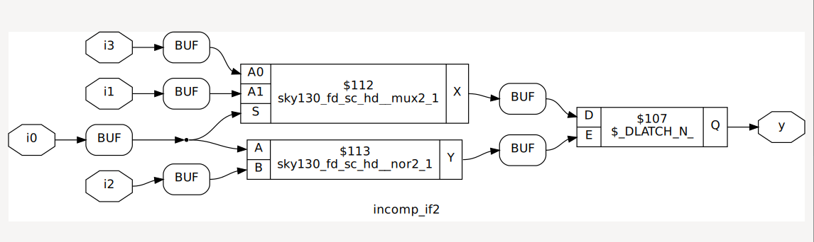

Generated netlist:

```text
netlist/incomp_if2_netlist.v
```

## Complete and Incomplete `case` Statements

A combinational `case` statement must assign every output for every possible selector value.

### Complete Case

The complete case uses a `default` branch:

```verilog
case (sel)
    2'b00:  y = i0;
    2'b01:  y = i1;
    default: y = i2;
endcase
```

The `default` branch covers `sel=10` and `sel=11`. Since `y` is always assigned, no storage is needed.

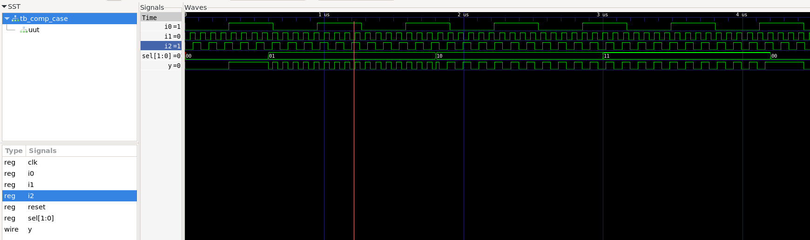

The mapped design contains only combinational SKY130 cells and no latch.

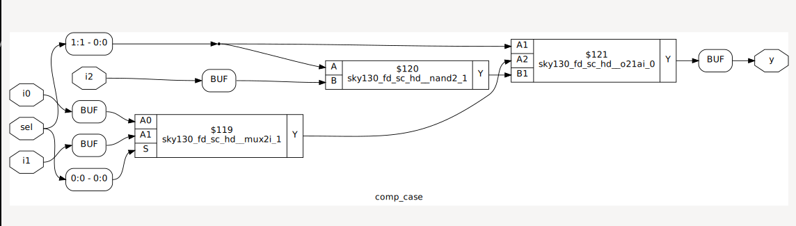

Generated netlist:

```text
netlist/comp_case_netlist.v
```

### Incomplete Case

The incomplete version handles only `sel=00` and `sel=01`:

```verilog
case (sel)
    2'b00: y = i0;
    2'b01: y = i1;
endcase
```

For `sel=10` and `sel=11`, `y` has no new assignment and retains its previous value.

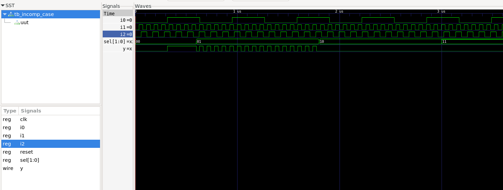

Yosys therefore inferred a latch after the selection logic.

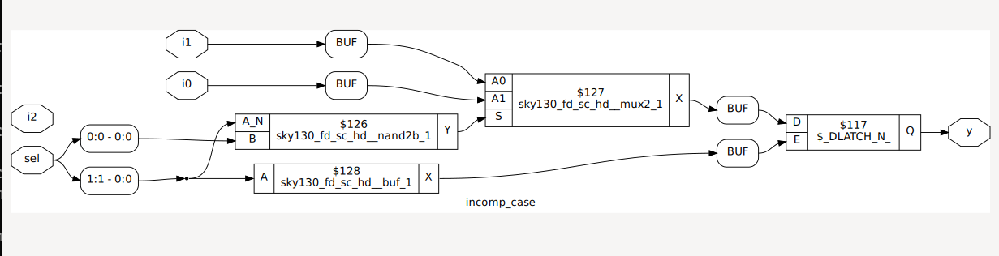

Generated netlist:

```text
netlist/incomp_case_netlist.v
```

### Partial Assignment in a Case

A case statement can cover every selector value while still being incomplete for an individual output.

In `partial_case_assign`, output `y` is assigned in every branch, but `x` is not assigned when `sel=01`.

The result is:

* `y` remains combinational.
* `x` retains its previous value for `sel=01`.
* Synthesis infers a latch only for `x`.

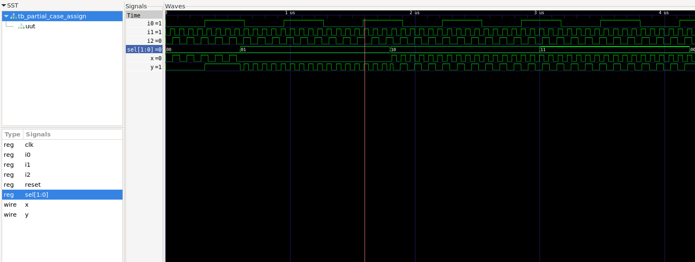

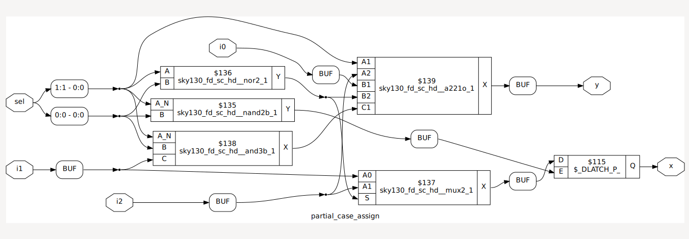

Generated netlist:

```text
netlist/partial_case_assign_netlist.v
```

This shows that assignment completeness must be checked separately for every output.

## Overlapping Case Items

The `bad_case` design accidentally contains two entries for `2'b10` and no entry for `2'b11`:

```verilog
case (sel)
    2'b00: y = i0;
    2'b01: y = i1;
    2'b10: y = i2;
    2'b10: y = i3;
endcase
```

During RTL simulation, the first matching branch wins. Therefore, `y` follows `i2` for `sel=10`. For `sel=11`, no branch matches and `y` retains its previous value.

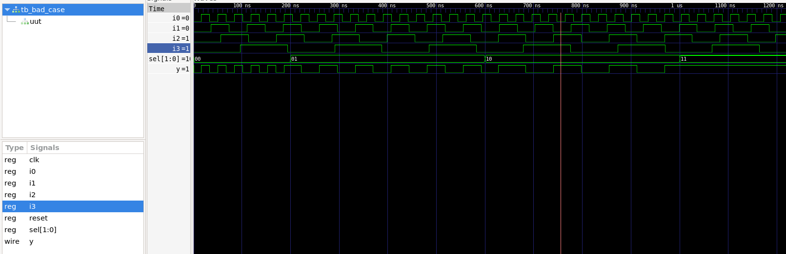

Synthesis converted the description into combinational SKY130 logic.

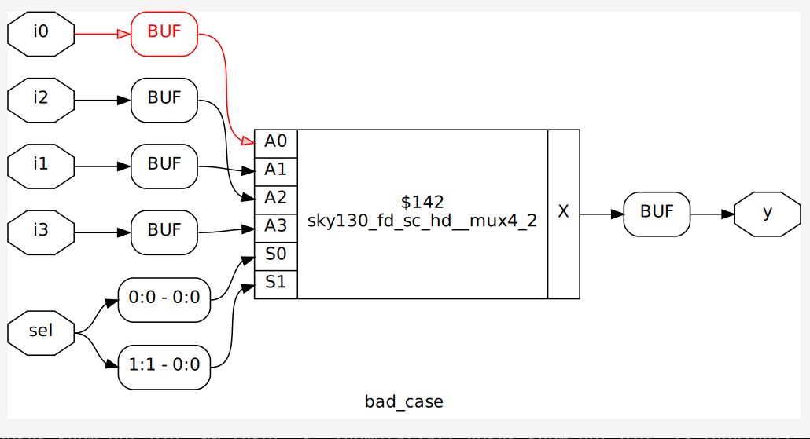

The mapped netlist was then simulated with the SKY130 cell models:

```bash
iverilog -o gls_bad_case \
  ../my_lib/verilog_model/primitives.v \
  ../my_lib/verilog_model/sky130_fd_sc_hd.v \
  netlist/bad_case_netlist.v \
  tb_bad_case.v
```

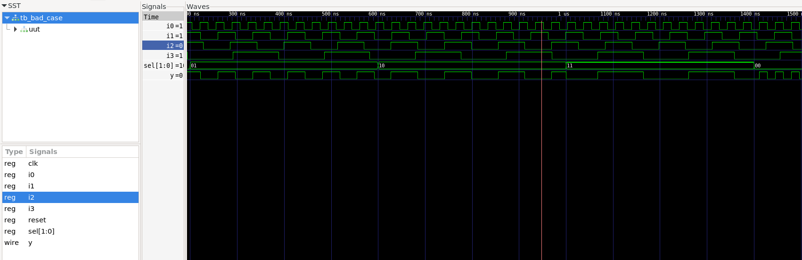

The GLS waveform differs from the RTL waveform for the problematic selection. This demonstrates why duplicate or overlapping case items should not be used: simulation follows procedural source order, while synthesis may optimize the logic differently.

Generated netlist:

```text
netlist/bad_case_netlist.v
```

## Procedural `for` Loops

A synthesizable procedural loop does not execute repeatedly over time like a software loop. The synthesis tool unrolls it into combinational hardware.

### 4-to-1 Multiplexer

The `mux_generate` design uses a procedural `for` loop to select one of four inputs:

```verilog
for (k = 0; k < 4; k = k + 1) begin
    if (k == sel)
        y = i_int[k];
end
```

Although the filename contains “generate,” this is a procedural loop inside an `always` block, not a Verilog generate block.

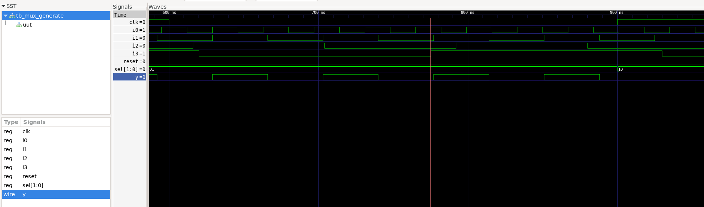

Yosys synthesized the loop into combinational 4-to-1 multiplexer logic.

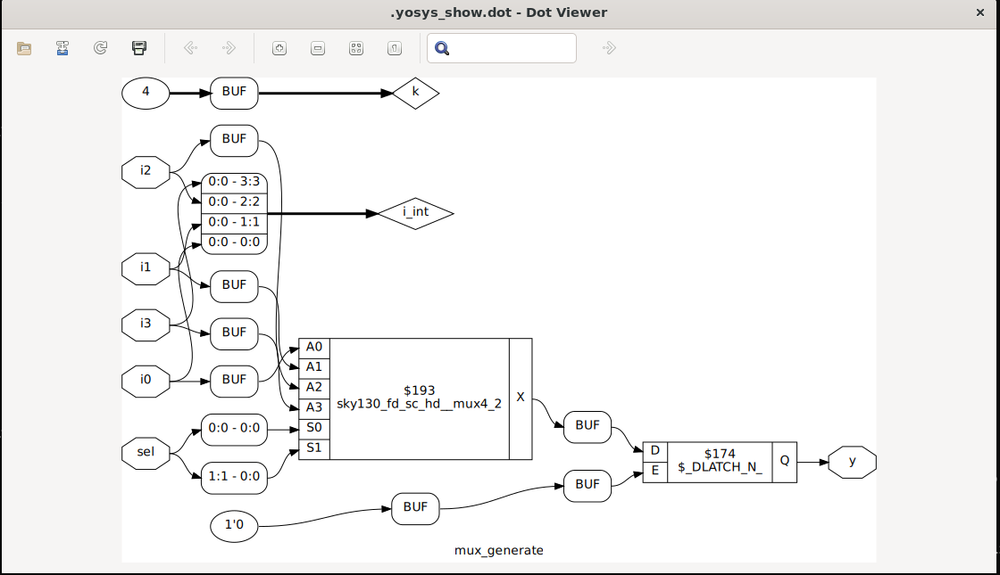

Generated netlist:

```text
netlist/mux_generate_netlist.v
```

### 1-to-8 Demultiplexer Using `case`

The first demultiplexer clears all outputs and sends input `i` to the output selected by `sel`.

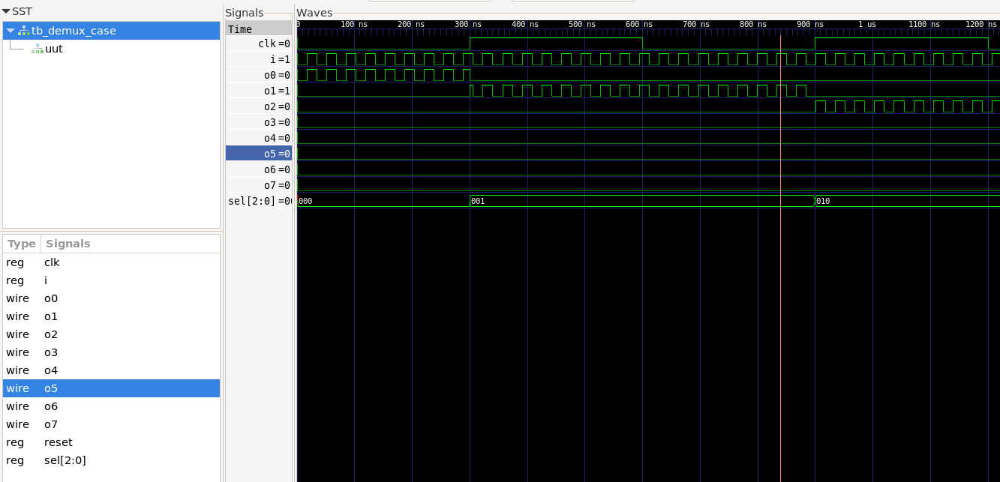

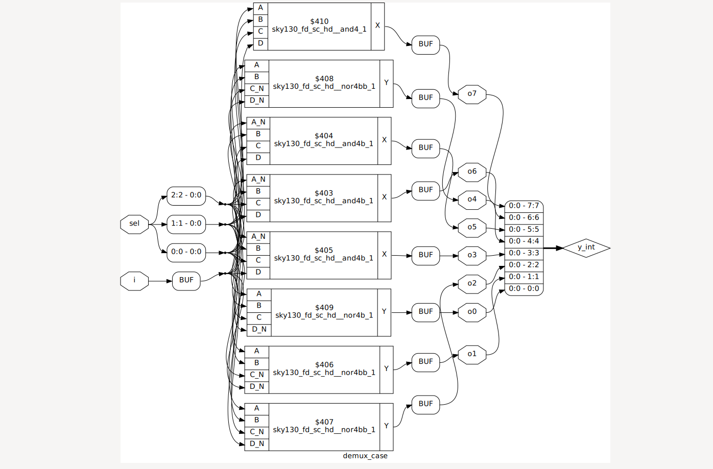

Generated netlist:

```text
netlist/demux_case_netlist.v
```

### 1-to-8 Demultiplexer Using a `for` Loop

The second demultiplexer implements the same function using a procedural loop:

```verilog
y_int = 8'b0;

for (k = 0; k < 8; k = k + 1) begin
    if (k == sel)
        y_int[k] = i;
end
```

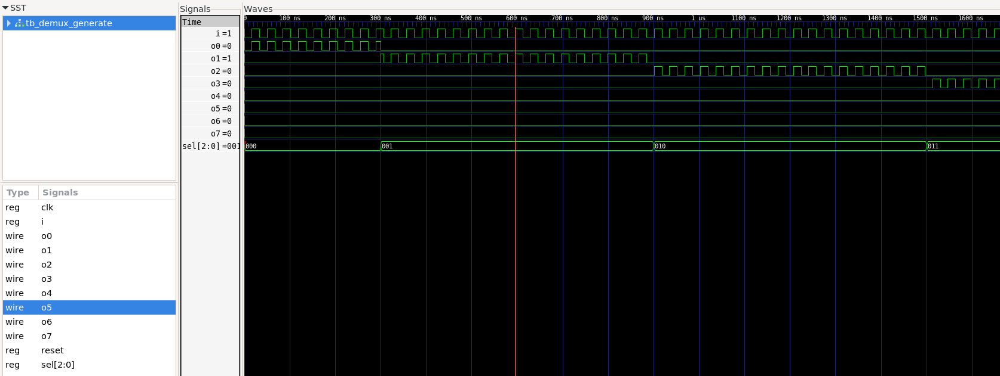

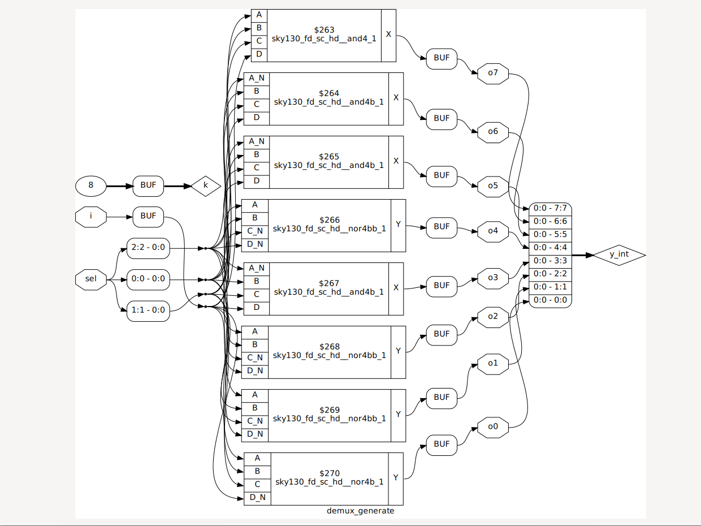

Generated netlist:

```text
netlist/demux_generate_netlist.v
```

Both descriptions produce equivalent combinational behavior. The synthesized schematics may look slightly different because ABC is free to choose different combinations of available SKY130 cells.

## Generate Block and Ripple-Carry Adder

A generate loop is written at module scope using `genvar`. Unlike a procedural loop, it is mainly used to create repeated hardware instances.

The 8-bit ripple-carry adder contains eight full adders:

* The first full adder uses a carry-in of zero.
* Each remaining full adder receives the carry-out from the previous bit.
* The final carry becomes `sum[8]`.

```verilog
genvar i;

generate
    for (i = 1; i < 8; i = i + 1) begin
        fa u_fa_1 (
            .a(num1[i]),
            .b(num2[i]),
            .c(int_co[i-1]),
            .co(int_co[i]),
            .sum(int_sum[i])
        );
    end
endgenerate
```

The waveform confirms:

```text
sum = num1 + num2
```

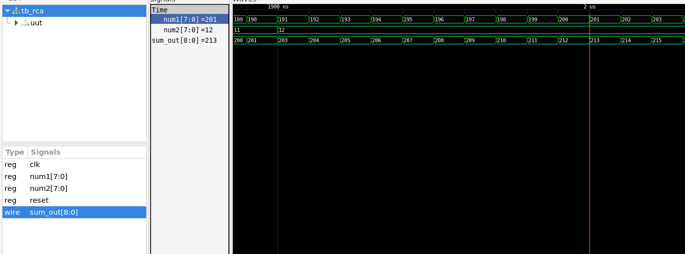

The carry moves from one full-adder stage to the next, which makes the design simple but causes its worst-case delay to increase with the number of bits.

## Results Summary

| Design                | Main observation                         | Synthesized result        |
| --------------------- | ---------------------------------------- | ------------------------- |
| `incomp_if`           | Missing `else`                           | Latch on `y`              |
| `incomp_if2`          | Priority logic with missing final `else` | Selection logic and latch |
| `comp_case`           | Complete assignment using `default`      | Combinational logic       |
| `incomp_case`         | Selector values not covered              | Latch on `y`              |
| `partial_case_assign` | `x` missing from one branch              | Latch only on `x`         |
| `bad_case`            | Duplicate item and missing selection     | RTL/GLS mismatch          |
| `mux_generate`        | Procedural loop used for selection       | 4-to-1 mux                |
| `demux_case`          | Demux described with `case`              | Combinational demux       |
| `demux_generate`      | Demux described with a procedural loop   | Combinational demux       |
| `rca`                 | Full adders replicated using `generate`  | 8-bit ripple-carry adder  |

## Key Takeaways

* An incomplete combinational assignment causes the output to retain its old value and usually infers a latch.
* Assignment completeness must be checked for every output independently.
* An `if-else if` chain describes priority.
* A complete `case` statement should cover all intended selections, normally with a suitable `default`.
* Duplicate or overlapping case items can produce synthesis–simulation mismatches.
* Procedural `for` loops are useful for expressing repeated combinational operations.
* Generate loops create repeated hardware instances during elaboration.
* Synthesizable loops are expanded into hardware rather than executed over time.
* Ripple-carry adders are simple, but their carry delay grows with the number of stages.
